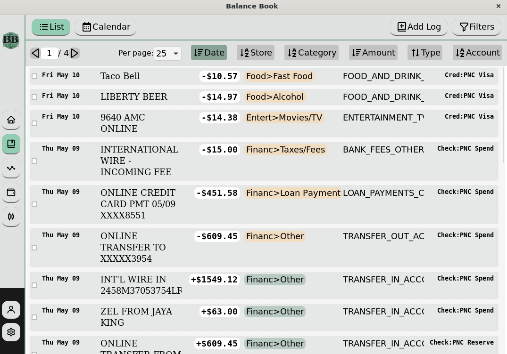
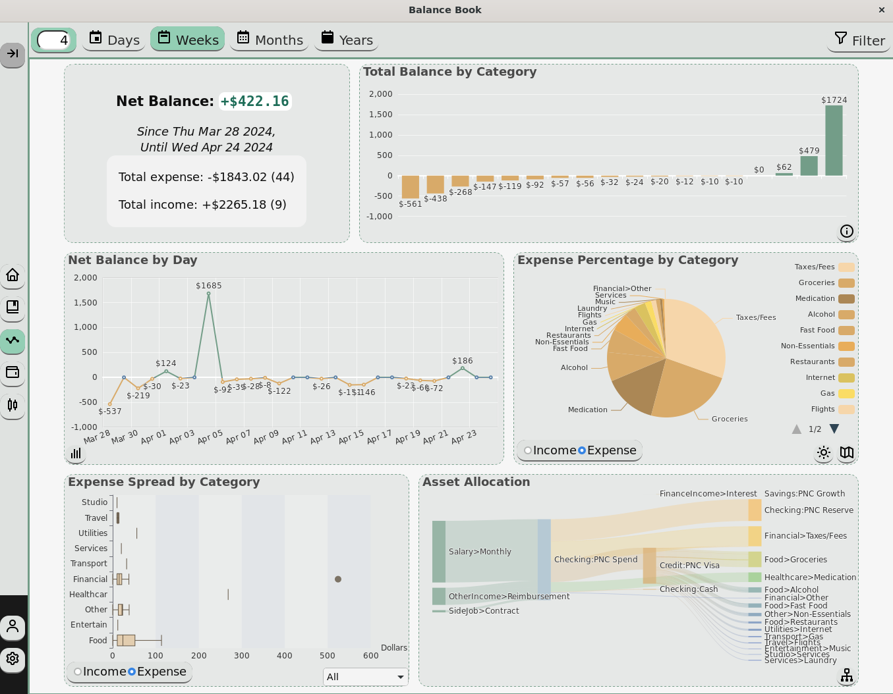
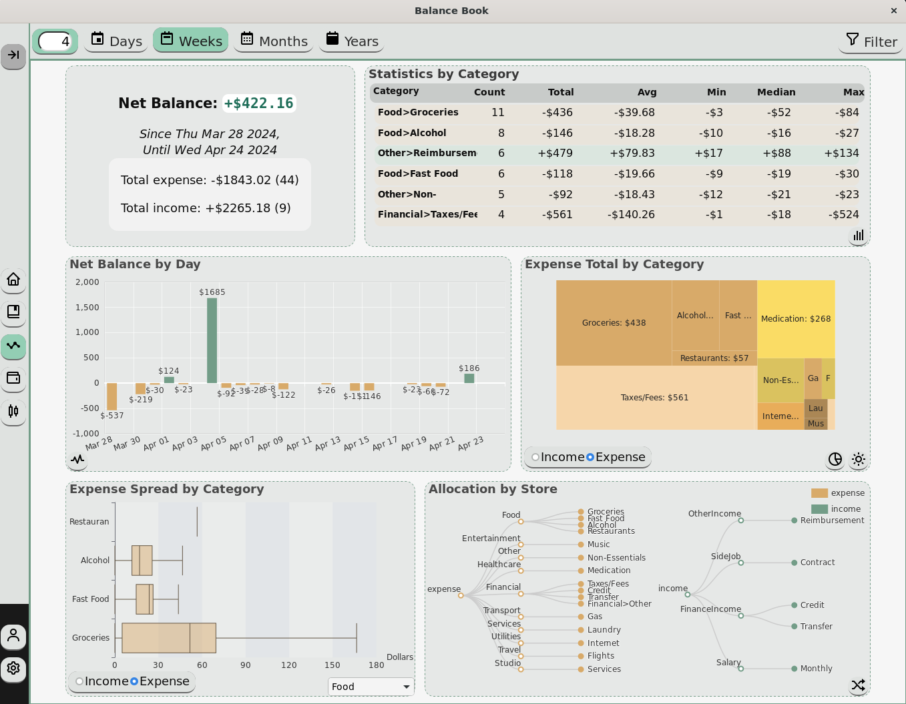
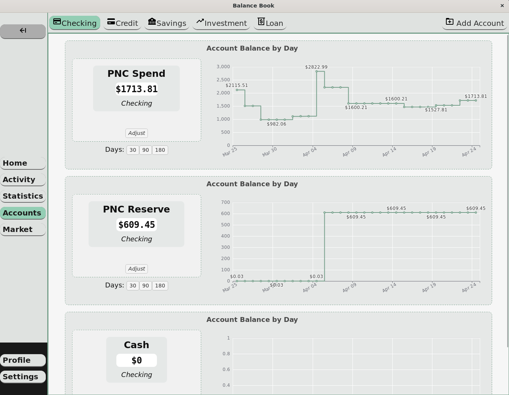
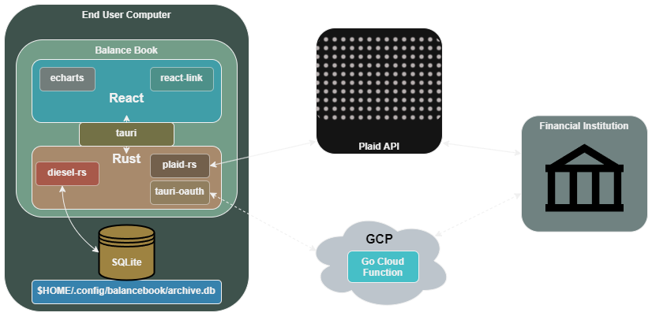

<h1 align="center">
  <br/>
  Balance Book
</h1>

## Contents
- <a href='#intro'>Introduction</a>
- <a href='#start'>Getting Started</a><br/>
&nbsp;&nbsp;&nbsp;&nbsp;- <a href='#plaid'>Configure Plaid</a><br/>
&nbsp;&nbsp;&nbsp;&nbsp;- <a href='#app'>Configure Application</a><br/>
- <a href='#feature'>Features</a><br/>
&nbsp;&nbsp;&nbsp;&nbsp;- <a href='#general'>General</a><br/>
&nbsp;&nbsp;&nbsp;&nbsp;- <a href='#activity'>Activity</a><br/>
&nbsp;&nbsp;&nbsp;&nbsp;- <a href='#stats'>Statistics</a><br/>
&nbsp;&nbsp;&nbsp;&nbsp;- <a href='#account'>Accounts</a><br/>
- <a href='#dev'>For Developers</a><br/>
&nbsp;&nbsp;&nbsp;&nbsp;- <a href='#stack'>Stack</a><br/>
&nbsp;&nbsp;&nbsp;&nbsp;- <a href='#arch'>Architecture</a><br/>
&nbsp;&nbsp;&nbsp;&nbsp;- <a href='#contribute'>Contributing</a><br/>
&nbsp;&nbsp;&nbsp;&nbsp;- <a href='#misc'>Misc</a><br/>

<h2 id='intro'>Introduction </h2>

Balance Book is an open-source, cross-platform desktop application for managing personal finance. The primary functions of this app feature tools for filtering, sorting, and visualizing recent transactions and account balances. This application uses Plaid open banking API to synchronize transactions and account balances, automatically.

The goal of Balance Book is to provide users with free, useful information and insightful statistics regarding their financial data, which is periodically updated and stored locally for accuracy and privacy (since your financial data is only stored on your computer, ONLY YOU have access to your data, but this disallows cloud backups and storage).

<h2 id='start'>Getting Started </h2>

If you would like to use this application on your computer, these instructions are for you (no programming experience required):

To use this app on your own device (desktop only at the moment), please sign up for a free account with [Plaid](https://plaid.com/). For this project to remain free for myself and all users, each user must bring their own (Plaid) client ID and (Plaid) environment secret. Plaid allows for free API use in hobby projects, and each client supports 100 bank account items.

> *Use <a href='./PLAID.md'>PLAID.md</a> as a reference while reading through these instructions*

After you create an account with Plaid, we need to do a few things:
<h3 id='plaid'>Configure Plaid: </h3>

1. On the <a href='https://dashboard.plaid.com/overview'/>Dashboard page</a>, you need to request Development Access. You must verify your email and submit a short application, which may take ~2 days to be approved (Balance Book can be described when a product description is requested). This grants your Plaid client access to the Development environment, which is necessary for fetching real-world data (on June 20, 2024 the Dev environment will be decomissioned and free item testing will be available within Production environment).

2. To connect to live data, Plaid and US financial institutions require the Plaid client to register for OAuth access (OAuth allows for this application to initiate logins to your private bank). To register for OAuth access, proceed through the checklist found <a href='https://dashboard.plaid.com/settings/compliance/us-oauth-institutions'/>here</a>. 
- Required actions:

  - **Apply for Production access**: This is a multi-page form; at the end you will be prompted to select a billing plan and enter payment information. As long as you keep your client ID and secret private and connect only to your personal financial institutions, you won't incur any charges. Until 20 June 2024, you should use your development secret for hobby-use. After that, free testing will be available in production (README will be updated).

  - **Configure application display information**: it is not necessary that you provide identical information as I have shown, but you may use the icon at ./src-tauri/icons/app-icon.png and brand color #739D88; it is necessary that you provide a unique application name.

  - **Configure company profile**: you may use whatever name you like, but I suggest making it explicit that the associated legal entity is fake (i.e. My Fake Entity). However, this shouldn't matter -- the only person using your Plaid client is you.

  - **Sign Plaid MSA**: should have been completed upon requesting Production access

  - **Complete security questionnaire**: there is no picture-by-picture walkthough for this part; answer each question to the best of your knowledge, and put "No" if you don't understand. For your reference, this application does not share any information with any computer other than the one it was downloaded on.

3. On the <a href='https://dashboard.plaid.com/developers/api'/>API page</a>, you need to configure the allowed redirect URLs. Add the following redirect URL: ```https://us-central1-balance-book-auth.cloudfunctions.net/balance/callback```, and save changes. This is necessary because of Plaid's security policies.

4. Finally, go to the <a href='https://dashboard.plaid.com/developers/keys'/>Keys page</a>. Copy two of these values to use later: client ID and development secret. Once you launch the application you can submit these to enable access to real-world data.

Once you have configured the redirect URL, have working access to the development environment, and have been approved for OAuth:

<h3 id='app'>Configure Application: </h3>

1. Go to <a href='https://github.com/zekissel/balance-book/releases'/>Releases</a> on this repository page. Download the appropriate installer for your system (Windows, MacOS, Linux).

2. Once downloaded, install it on your system like any other application.

3. On the first launch, you will need to register a username and password.

4. Once logged in, go to the "Profile" tab on the navigation menu. On the "Financial" tab you are presented with two inputs: one for your client_id and secret respectively. Fill in these values with the values found in the last step of <a href='https://dashboard.plaid.com/developers/keys'>Configure Plaid</a>, and save your changes.

5. At this point, you can select "Start Link Process", which will open Plaid/Link and allow you to choose your financial institution. Typically logins can be completed within the application, however (depending on the institution) it is also normal to be temporarily redirected to your default browser for authentication.

<h2 id='feature'>Features </h2>

<h3 id='general'>General: </h3>

- Without connecting to Plaid, Balance Book can still be used to manually track expenses, purchases, and account balances. The same statistics will be provided. If Plaid is not initialized, the user must enter financial information periodically and accurately.

- It is highly encouraged to connect Plaid to maximize the potential of the application. Upon logging into your bank account the first time, all selected financial accounts will be recognized by Balance Book and mirrored within the database. Also, the past 90 days of transaction information will be read and stored locally. Now, every time* you log in to the app, recent transactions with your financial institution will be synchronized and stored for future retrieval. **will not refresh for consecutive logins within 6 hours (max 4 refreshes/day); refreshes are also dependent upon your financial institution availability (status info available in Balance Book under "Profile" tab)*


<h3 id='activity'>Activity: </h3>

- List and calendar views of recent transactions. Filter and sort by transaction date, source, category, amount, account, etc. Edit transactions from this page.




<h3 id='stats'>Statistics: </h3>

- Multiple graphs to illustrate income and expenses. Adjustable timeframe and filterable fields. Select to change graph view or double-click to toggle fullscreen.



---




<h3 id='account'>Accounts: </h3>

- View current and recent account balances, for all types of financial accounts. Option to manually create accounts to track (cash).




<h2 id='dev'>For Developers </h2>

<h3 id='stack'>Stack: </h3>

- Frontend: <a href='https://www.typescriptlang.org/'>TypeScript</a>, <a href='https://react.dev/'>React</a>, <a href='https://echarts.apache.org/en/index.html'>Apache ECharts</a>, <a href='https://developer.mozilla.org/en-US/docs/Web/CSS'>Vanilla CSS</a>

- Backend: <a href='https://www.rust-lang.org/'>Rust</a>, <a href='https://tauri.app/'>Tauri</a> (v1), <a href='https://diesel.rs/'>Diesel</a>, <a href='https://www.sqlite.org/'>SQLite</a>

- 3rd Party API: <a href='https://plaid.com/'>Plaid</a> (requires HTTPS redirect: <a href='https://go.dev/'>Go</a> hosted on <a href='https://cloud.google.com/?hl=en'>GCP</a> (realistically cloud agnostic))


<h3 id='arch'>Architecture: </h3>



#### Link Initialization

When the user requests to initialize the Plaid/Link process:

1. Rust spawns a server to listen for redirects using tauri-oauth-plugin

2. Rust will query the Plaid API to create a link token, which is then passed to react-link on the frontend. Link uses this token to begin and proceed through login verification with private institutions.

3. Upon successful verification with a financial institution, the user will be redirected to the provided HTTPS URL (GCP cloud function), which redirects again to the server spawned by tauri-oauth-plugin (localhost).

4. The server on localhost will extract the public token from the redirect query. This is then exchanged for an access token through the Plaid API. Rust associates the access token with the current user and stores both in the database.

All relavant backend code can be found at ./src-tauri/src/link/auth.rs and relavant frontend code can be found at ./src/component/link/PlaidLink.tsx.

<h3 id='contribute'>Contributing: </h3>

If you would like to contribute for any reason, feel free to make a PR. I ask that you thoroughly explain any changes that you make, as well as what necessitated the change. I will prioritize merging bug fixes over new features.

<h3 id='misc'>Misc: </h3>

#### Developing Locally

To run the source code locally (using ```npm run tauri dev``` from the root directory, after installing npm dependencies), the file ./src-tauri/.env should be present, with the contents: "PLAID_ENV=development". This variable cannot be configured upon Plaid client instantiation from within plaid-rs at the moment.

#### Required HTTPS redirect

Plaid requires confirming a HTTPS redirect that financial institutions can send users to after account verification. Currently, I personally host the redirect URL that is hardcoded into the application, which lowers the barrier to entry for everyone. You can find the exact code I host at ./server/main.go. GCP offers 2 million free cloud function invocations per month, which I dont expect to surpass anytime soon. However, if you find that the redirect URL in the second to last step of <a href='#plaid'>Configure Plaid</a> does not redirect to localhost (you can test this right now by pasting the URL in your address bar), you must host the server yourself and configure the redirect URL in ./src/component/link/PlaidLink.tsx:getServerURL and your Plaid dashboard.


#### Planned Features

0. use tuari-stronghold for securely storing client ID, secret, access token

0. use statemanagement for handling auth state

1. News on home page; 2-3 recent financial articles pulled from a public API yet to be determined (configurable what kinds of articles are fetched). Minimal information necessary: article title, picture, date, and external link (to default browser)

2. Market tab; activity from investment accounts, including stock and crypto trades. Search functionality for publicly traded stocks (no plans for enacting trades/making payments from within app)

3. Budget tab; set one-time or recurring budgets. Ex: save $300 for concert tickets by X-date (one-time), or limit fast food expense to $75 per month (recurring). Configurable if budgets appear on other pages (activity, stats, accounts).

4. Collapsable view for account page: hide graphs and see more accounts at once without scrolling

5. Expand institution status information on Profile tab under Financial (fetch more details, better styling).

6. Email or phone verification and egress (solely for account recovery)

7. Client ID, secret, and access key encryption on datastore. (Possible full database encryption? -> Rusqlcipher. Doesn't seem easy with Diesel)

8. Settings:

- general:

  - misc: exclude routes (home, stats, market, budget)

  - home: option to replace account preview with budgets, news source

  - stats: use outliers for boxplot yes/no, disable specific graphs

- advanced: 

  - configure HTTPS redirect to provide Plaid

  - configure path where database is stored

  - import/export DB user info to/from CSV/json?

0. upgrade to tauri v2