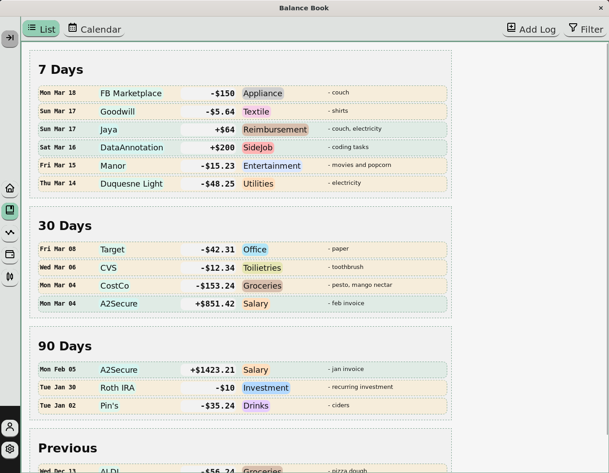
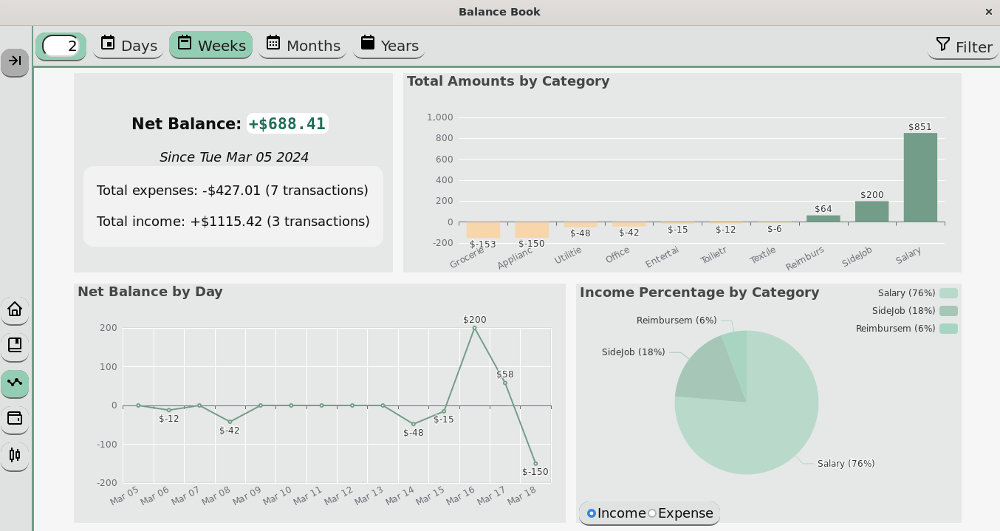
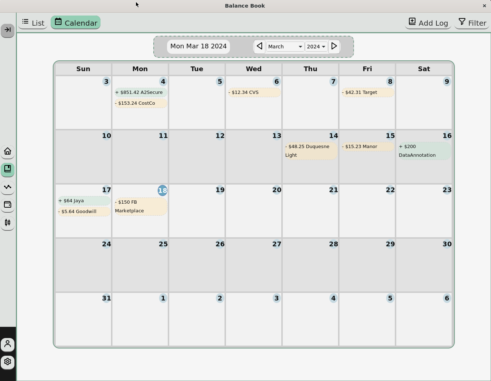

# Balance Book

## Desktop application for managing personal finance
### Made with Tauri, React, and Plaid

### Necessary for personal use:
- /src-tauri/.env present with config:
```env
PLAID_CLIENT_ID=<your-client-id>
PLAID_SECRET=<plaid-env-secret>

PLAID_ENV=development
PLAID_VERSION=2020-09-14
```
- Publicly hosted HTTPS redirect, confirmed in Plaid dashboard (code and Dockerfile for server at /server; GCP cloud function in comments): edit redirect URL in function /src/component/link/PlaidLink.tsx:getServerURL
---





