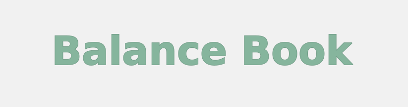
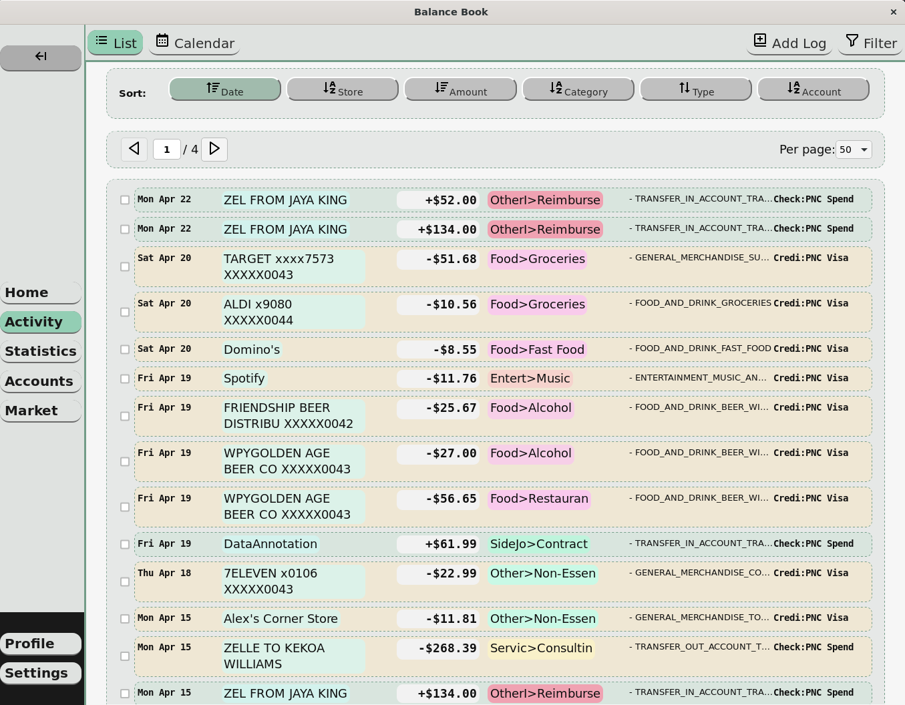

<h1 align="center">
  
</h1>


## Introduction

Balance Book is an open-source, cross-platform desktop application for managing personal finance. The primary functions of this app feature tools for filtering, sorting, and graphing recent transactions and account balances. This application uses Plaid open banking API to automatically synchronize transactions and account balances.

The goal of Balance Book is to provide free, useful information and statistics to the user about their financial data, while ensuring privacy. Your financial data is only stored on your computer. This means that ONLY you have access to it, but it also disallows for cloud backups / easy transfers between computers.

## Getting Started

If you have no experience with programming but would like to use this application on your own computer, these instructions are for you:

To use this app, you must sign up for a free account with [Plaid](https://plaid.com/). In order for this project to remain free for myself and all users, each user must bring their own Plaid client_id and Plaid development environment secret (Plaid allows for free API use in hobby projects, and each Plaid client supports 100 bank accounts). 

After you create an account with Plaid, we need to do a few things:
### Configure Plaid
1. On the [Dashboard page](https://dashboard.plaid.com/overview), you need to Request Development Access. There is a small checklist to follow in order to submit and be approved (may take ~2 days to be approved). This grants your Plaid client access to the Development environment, which is necessary for fetching real-world data.
2. On the [API page](https://dashboard.plaid.com/developers/api), you need to configure the allowed redirect URLs. Add the following redirect URL: ```https://us-central1-balance-book-auth.cloudfunctions.net/balance/callback```, and save changes. This is necessary for OAuth support for institutions.
3. Finally, go to the [Keys page](https://dashboard.plaid.com/developers/keys). Copy two of these values to use later: client_id and Development secret. Once you launch the application you can submit these to enable access to real-world data.

Once you have configured the redirect URL and have working access to the development environment:
### Configure Application
1. Go to [Releases](https://github.com/zekissel/balance-book/releases) on this repository page. Download the appropiate installer for your system (Windows, MacOS, Linux).
2. Once downloaded, install on your system like any other application.
3. On first launch, you will need to register a user and password.
4. Once logged in, go to the "Profile" tab on the navigation menu. On the "Financial" tab you are presented with two inputs: one for your client_id and secret respectively. Fill in these values with the values found in [Configure Plaid: Step 3](https://dashboard.plaid.com/developers/keys), and select the button to update Plaid info.
5. At this point, you can select to "Start Link Process", which will open Plaid/Link and allow you to select your financial institution. Typically logins can be completed within the application, however (depending on institution) it is also normal to be temporarily redirected to your default browser for authentication.

## Features

### Activity: 
- list and calendar views of recent transactions. Filter and sort by transaction date, source, category, amount, and account



### Statistics: 
- multiple charts and graphs to illustrate income and expenses. Adjustable timeframe and filterable fields. Double click charts to see full-screen.


---


### Accounts:
- view current and recent account balances, for all types of accounts


## For Developers:

Stack:
- Frontend: TypeScript, React, Apache ECharts, Vanilla CSS
- Backend: Rust, Tauri, SQLite
- 3rd Party API: Plaid